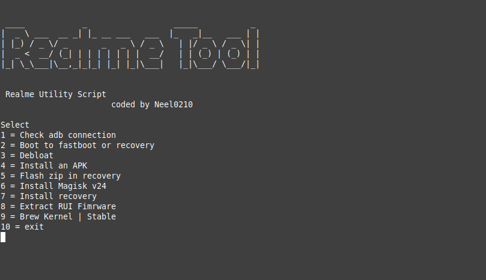

<p align="center">
        
        <br>
    <b>Management tool for Realme Device | I use it for Realme 6 Pro</b>
        </br>
 </p>
 
<p align="center">
 <b><i>_Realme Tool🔥_</i></b>
</p>


[](https://t.me/prishsupport)

#### Common things this tool can do for you!

List:

- 1st (`Install adb and platform tools`)
- 2nd (`Boot to recovery and bootloder`)
- 3rd (`Debloat RealmeUI | AOSP`)
- 4th (`Install an APK`)
- 5th (`Flashing zip file`)
- 6th (`Install Magisk`)
- Much more soon!

# How to use / what to do

  - open terminal  and copy paste below given cmd  
```yaml
git clone https://github.com/neel0210/RealmeTool.git && cd RealmeTool && chmod a+x neel.sh && bash tools.sh
```
### It will show you Screen like this

<div align="center">
    
</div>

